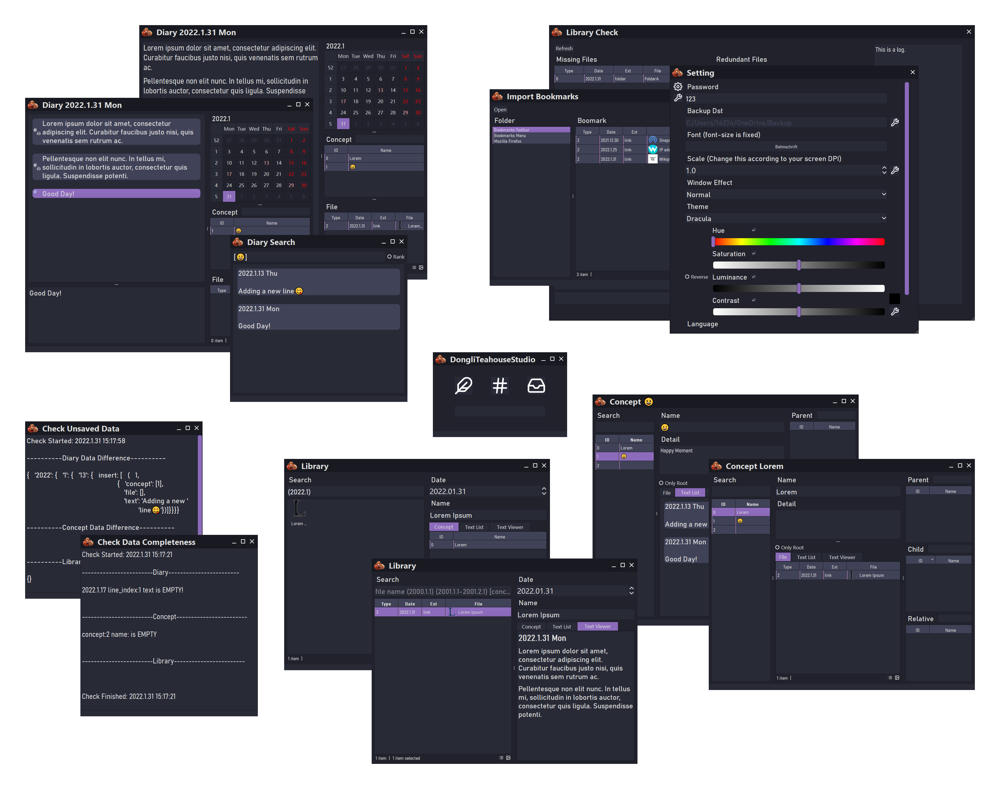
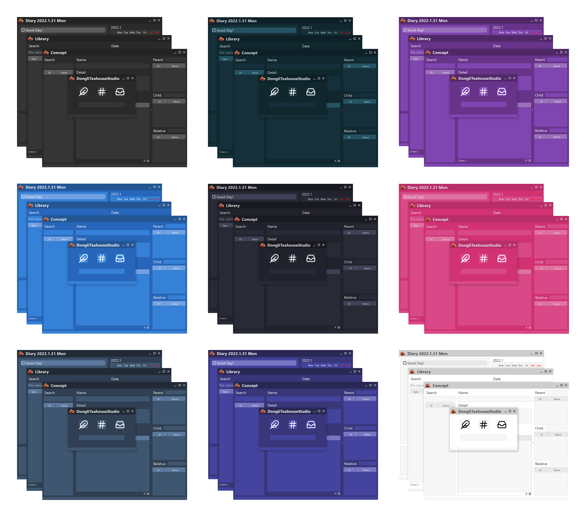

# DongliTeahouseStudio2

This is the 2.0 version of the [DongliTeahouseStudio](https://github.com/Holence/DongliTeahouseStudio). Compared to the previous version, v2.0 is more elegant and much easier to use.

## Installation

Download from [Github Release](https://github.com/Holence/DongliTeahouseStudio2/releases) to get the latest build for Windows.

or build with pyinstaller on your own:

`git clone https://github.com/Holence/DongliTeahouseStudio2.git`

`python -m venv env_build`

`.\env_build\Scripts\activate`

`pip install -r .\requirements.txt`

`pip install pyinstaller`

(you can install [UPX](https://upx.github.io/) to decrease the size)

build into One-Folder (Recommend):

`pyinstaller .\full.spec`

or build into single executable file:

`pyinstaller .\single.spec`

Finnaly, move these 3 things into `./dist/DongliTeahouseStudio` (or `./dist` if it's single executable build)

- `default.css` (this is a stylesheet for generating Epub)
- `icon` folder (some icons)
- `translation` folder (the `.py` and `.ts` files is not needed, you can delete them)

Also you can delete the folder `translation` and file `qt.conf` in `./dist/DongliTeahouseStudio/PySide2`, they are not needed.

## Demo

Here is a demo:

Here are some themes generated in custom settings:

